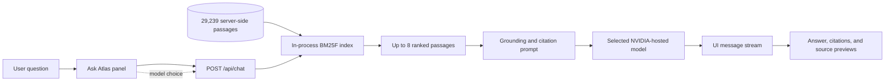
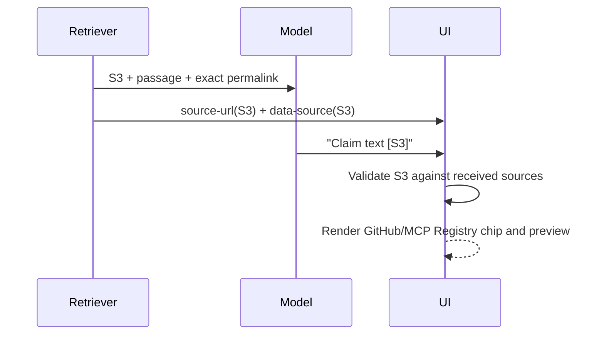

# AI engineering in MCP Atlas

MCP Atlas is a retrieval-augmented generation (RAG) application with a strict
source boundary. The language model does not browse the corpus, query a vector
database, read the browser's data files, or call MCP tools. A server-side
retriever selects a small evidence set first; only that evidence and the
conversation are sent to the selected model.

This document describes the engineering contract behind that behavior, the
streaming interface, and the controls that keep answers inspectable.

## System boundary



The dashed input is configuration, not evidence. Model choice changes the
generator but does not change retrieval or the source policy.

### What the model can access

For one turn, the model receives:

- the conversation messages;
- the system rules for grounding, citation syntax, and house style;
- at most eight retrieved passages, each labeled `S1` through `S8`;
- provenance fields for each passage: title, heading, authority, repository,
  path, and commit-pinned permalink.

The model does **not** receive:

- the remaining corpus or the inverted index;
- model API keys or server environment variables;
- Registry packages or executable repository code;
- browser-only state, other users' conversations, or an external memory store;
- permission to fetch a URL or execute instructions contained in a passage.

This distinction matters: the model writes from evidence selected by Atlas. It
does not independently retrieve or verify evidence.

## Request lifecycle

The implementation is split across three contracts.

| Contract | Implementation | Responsibility |
| --- | --- | --- |
| Retrieval | `app/src/lib/retrieval.ts` | Tokenize, score, apply source priors, and diversify passages |
| Generation | `app/src/app/api/chat/route.ts` | Build the evidence-only prompt, call the selected model, and stream the result |
| Presentation | `app/src/components/atlas/ask.tsx` | Render progress, answer text, inline citations, previews, and the source audit list |

### 1. Submit and model routing

The browser posts the full UI-message conversation plus a model key. The key is
resolved against a fixed allowlist in `app/src/lib/models.ts`. All four choices
use NVIDIA's OpenAI-compatible endpoint:

- Nemotron 3 Ultra (default)
- Kimi K2.6
- DeepSeek V4 Flash
- GLM 5.2

Availability is computed on the server from configured environment variables.
The browser receives only ready/not-ready model names; API keys never cross the
React Server Component boundary.

### 2. Retrieval

`retrieve()` searches a module-scoped BM25F inverted index. The index is built
from `app/data/retrieval-chunks.jsonl` on the first request in a server process
and reused by later requests.

Ranking combines lexical field scores with explicit priors:

- title, heading, and body term relevance;
- current-specification freshness;
- official-source authority and category;
- provenance penalties for housekeeping, proposals, and blog material;
- registry intent, so community listings do not outrank protocol requirements.

A diversity pass keeps no more than two passages from one document and normally
no more than one community Registry record. The final context is eight passages
or fewer. See [RETRIEVAL.md](RETRIEVAL.md) for the scoring formula and evaluation
results.

### 3. Prompt construction and injection boundary

`formatContext()` wraps every passage in a `<source id="S#">` block. The system
prompt declares those blocks untrusted reference data and forbids following
instructions found inside them. It lists the valid labels for the current
request and requires protocol claims to cite the one or two passages that
support them.

This is a prompt-injection boundary, not a claim that prompt injection is
solved. The stronger controls are architectural: retrieved text cannot select
tools, mutate the system prompt, read secrets, or execute code because the chat
route exposes none of those capabilities.

### 4. Streaming and truthful progress

The route returns an AI SDK UI message stream. It emits events in this order:

1. `data-progress: retrieving` before the local search starts;
2. `data-progress: ranking` with the selected passage count;
3. a standard `source-url` part plus a structured `data-source` part for every
   retrieved passage;
4. `data-progress: drafting` when the evidence prompt is ready;
5. streamed model text containing bare markers such as `[S2]`.

The loading panel renders these events as expandable progress steps. It does
not show percentage completion or fabricated tool traces. A visible Stop action
aborts the active generation, and reduced-motion users receive static state
markers instead of orbit animation.

## Citation and source UX

The `S#` label is a request-local foreign key shared by retrieval, generation,
and presentation.



The client normalizes grouped markers, removes labels that were not supplied by
the retriever, and links valid citations to commit-pinned URLs. Inline chips
show publisher identity (for example GitHub) beside `S3`. Hover or keyboard
focus opens a preview with the title, heading, and passage excerpt. The Sources
disclosure keeps the complete audit list and distinguishes passages cited by
the answer from passages that were retrieved but unused.

No citation is treated as proof merely because the model emitted it. The UI
validates label existence; users still need to inspect the linked passage for
load-bearing decisions.

## Reliability and failure behavior

- Provider 401/403, 404, and rate-limit failures receive different recovery
  messages instead of one generic error.
- The endpoint uses `Cache-Control: no-store`; conversations and generated
  answers are not cached by the route.
- Retrieval content is never executed. Registry records are untrusted metadata.
- The UI exposes stop, retry through a new turn, copy, exact-source opening, and
  the full source audit list.
- Streaming announcements are phase-level, not token-level, so screen readers
  are not flooded as text arrives.

For a public deployment, platform rate limiting, abuse monitoring, request-size
limits, and provider spend alerts are still required operational controls.

## Evaluation and change discipline

Retrieval quality is evaluated independently from prose quality:

```bash
cd app
npm run eval:retrieval
npm run eval:retrieval -- --detail
npm run eval:retrieval -- --sweep
```

The fixed question set reports hit@1, hit@3, and hit@8. Hit@8 is the primary
grounding measure because the generator sees the full selected set. Any change
to tokenization, priors, limits, or corpus generation should run this evaluation
alongside data validation, TypeScript, lint, the production build, and browser
tests of progress and citations.

## Known engineering limits

- Retrieval is lexical, so synonym-only questions can miss relevant passages.
- The first query in a fresh server process pays the index-build cost.
- Source ranking is evaluated on a deliberately small regression set and cannot
  establish semantic correctness for every MCP question.
- Citation validation proves that a label was retrieved, not that the cited
  passage logically entails every word of the claim.
- The four generators may differ in citation discipline even with the same
  evidence and prompt.

These are explicit product constraints, not hidden model capabilities.
