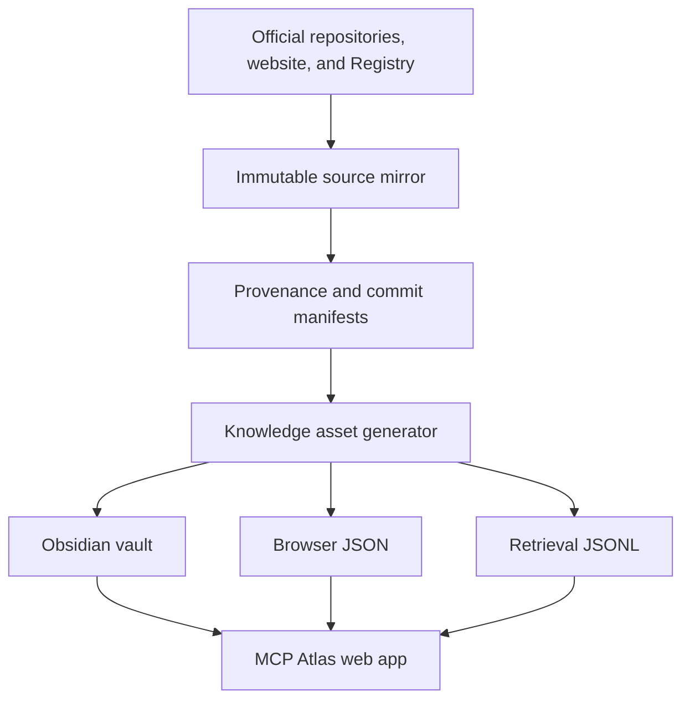
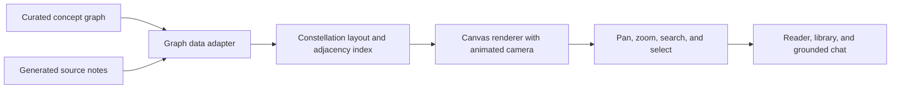
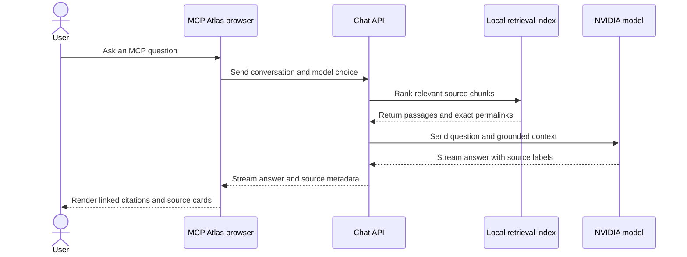

# MCP Atlas architecture

`mcp-knowledge/` is the project root and the boundary for corpus, vault, application, and deployment work.

## Data flow



## Layers

### Canonical source layer

`official-repos/`, `website/`, and `registry/` hold upstream material. Repository manifests record exact commit hashes. File manifests record path, provenance, retrieval time, size, and SHA-256 hash.

The application does not execute mirrored code or Registry package instructions.

### Generated presentation layer

`scripts/build_knowledge_assets.py` creates three independent outputs:

1. `vault/` for local Obsidian navigation
2. `app/public/data/` for browser search, reading, concepts, and Registry browsing
3. `app/data/retrieval-chunks.jsonl` for server-side grounded retrieval

Generated source notes have stable IDs derived from repository and source path. Official links are rewritten to commit-pinned GitHub permalinks. Images use commit-pinned raw GitHub URLs.

Curated notes in `vault/20 Concepts/` and `vault/80 Maps/` are created only when missing. Rebuilding source notes does not overwrite later human edits to those curated files.

### Web application layer

The Next.js app is under `app/`. Its main views are:

- Home dashboard
- Searchable knowledge library
- Source reader with exact provenance
- Interactive concept graph
- Active MCP server catalogue
- Grounded chat guide

Large data is loaded only when its view needs it. The Registry catalogue is not part of the initial client bundle.

#### Interactive graph architecture

The graph view has two scopes. Concepts presents the 16 curated protocol concepts and their direct relationships. All notes adds every generated source note, producing 1,130 nodes and 3,011 links in the current corpus.

A purpose-built HTML canvas renderer draws the network. A deterministic constellation layout places concept clusters on a wide ring and settles each source note into a phyllotaxis halo around the concept it explains, so the same corpus always produces the same map and no layout worker is needed. The renderer keeps its own camera, adjacency index, and label collision pass, and animates at display refresh rate for the full 1,130-node scope.



Selecting a concept highlights its immediate neighborhood and exposes connected concepts or notes. Selecting a note can open the corresponding source reader directly. Search uses deferred input and map lookups so it remains responsive in the full corpus view.

The interface supports dark and light themes, responsive desktop and mobile layouts, a home-linked brand mark, and a grounded chat drawer that can be resized on the desktop and becomes a sheet on small screens.

### Retrieval and chat layer

The server route performs local lexical retrieval over prebuilt chunks. Ranking weights title, heading, body terms, source authority, category, freshness, and source diversity. Current specification sources receive a preference over older drafts and secondary material.

Retrieved passages are marked as untrusted reference data. The model is instructed to answer only from those passages and to emit source labels such as `[S1]`. The client maps labels to exact source URLs and also shows an expandable source list.



The default model is `nvidia/nemotron-3-ultra-550b-a55b` through NVIDIA's OpenAI-compatible endpoint. Kimi K2.6, DeepSeek V4 Flash, and GLM 5.2 use the same endpoint and appear when their server-side keys are configured. Model choice changes generation only; every model receives the same server-retrieved evidence contract. See [AI-ENGINEERING.md](AI-ENGINEERING.md) for the model boundary, stream events, citation validation, and failure behavior.

## Security boundaries

- Model API keys remain in server environment variables.
- `.env` files are ignored by Git.
- Browser builds receive only `NEXT_PUBLIC_` configuration.
- The chat endpoint can restrict cross-origin requests with `ALLOWED_ORIGIN`.
- Retrieval content cannot select tools or modify the system prompt.
- Registry entries are searchable metadata, not executable code.

For a public deployment, add platform rate limiting and abuse monitoring at the chat backend before sharing the URL widely.

## Deployment options

### Full application

Deploy `app/` to a Node.js host or Vercel. Configure:

```text
NVIDIA_NEMOTRON_API_KEY=...
ALLOWED_ORIGIN=https://your-site.example
```

This mode serves both the static knowledge interface and `/api/chat` from one deployment.

### GitHub Pages with external chat

Build the explorer as static files:

```bash
cd app
NEXT_PUBLIC_BASE_PATH=/repository-name \
NEXT_PUBLIC_CHAT_API_URL=https://api.example.com/api/chat \
npm run build:pages
```

Publish `app/out/` to GitHub Pages. The chat backend must be deployed separately because a static site cannot protect model keys. Set its `ALLOWED_ORIGIN` to the exact Pages origin.

The included `.github/workflows/pages.yml` calculates the repository base path and reads the external chat URL from the `CHAT_API_URL` repository variable.

## Validation

`scripts/validate_knowledge_assets.py` verifies:

- Generated counts match the catalogue
- Document and chunk IDs are unique
- Official links contain their recorded commit
- Every browser document has a corresponding vault note
- Registry and graph outputs are present

TypeScript, ESLint, production builds, dependency audit, and browser interaction checks cover the application layer.
