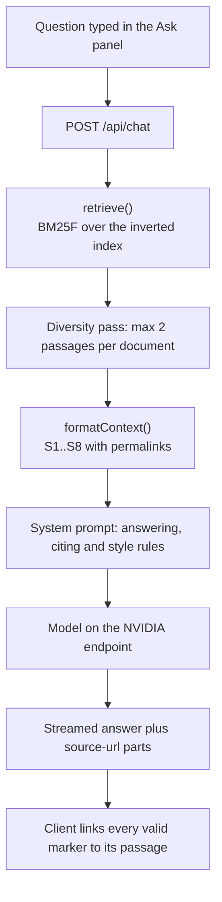

# How Atlas answers a question

Atlas answers from the mirrored corpus, never from model memory. This document
traces one question end to end, from keystroke to a citation that resolves to an
exact commit.

There is no vector database, no embedding model and no external retrieval
service in the answer path. The reason is size: the corpus is 29,239 passages
and about 1.3M tokens, which indexes in roughly a second and searches in single
digit milliseconds in the same process that serves the request. A network hop to
a vector store would cost more latency than the entire search does.

## The path of one question



Only the retrieved passages reach the model. The rest of the corpus is never
sent anywhere.

## 1. Building the corpus

`scripts/build_knowledge_assets.py` turns the mirrored repositories into
`app/data/retrieval-chunks.jsonl`, one JSON object per line.

- Markdown is split on headings, then long sections are split again at roughly
  3,600 characters, so a passage stays inside one topic.
- Each passage keeps its `title`, `heading`, `sourcePath`, `repository`,
  `commit`, `category` and `authority`.
- Passages are deduplicated by SHA-256 of their normalised text, so text
  repeated across SDK repositories is stored once.
- `sourceUrl` is a commit-pinned GitHub permalink. This is what makes a citation
  verifiable rather than decorative.

Registry records become one passage each, at `authority: community`. They are
19,638 of the 29,239 passages, which matters for ranking (see step 3).

## 2. Building the index

On first query, `app/src/lib/retrieval.ts` reads the JSONL once and builds an
inverted index that lives in module scope for the life of the process.

Tokenising is deliberately identifier-aware. `tools/call` is indexed both whole
and split, so the exact method name and a bare "tools" both find it.

Each posting stores the chunk index plus three term frequencies, one per field:

| Field | Contents |
| --- | --- |
| title | document title |
| heading | the heading the passage sits under |
| body | passage text and source path |

Cost: about 1.2 seconds and a few tens of megabytes, paid once per process.

## 3. Ranking

Scoring is Okapi BM25 computed per field and summed, weighted by field.

```
score(chunk) = Σ  IDF(term) × ( w_title·bm25_title + w_heading·bm25_heading + w_body·bm25_body )
              terms
```

Three details do most of the work:

**IDF replaces a stop-word list.** An earlier version hand-listed `mcp` as a stop
word, so "What is MCP?" tokenised to nothing and returned zero sources. The model
then had no choice but to answer "the sources do not establish this". Inverse
document frequency handles commonness on its own: a term in most passages earns
almost no weight, without anyone maintaining a list.

**Length normalisation is per field.** Body text uses the usual `b = 0.75`.
Titles use `b = 0.3`, because a short title is not evidence of relevance. At
0.75 a repository README titled "MCP Python SDK" outranked the specification on
"what is MCP", purely for being short.

**Priors follow the source policy.** After the text score, a multiplier applies
authority, category, freshness and provenance. The current specification is
promoted; superseded revisions are demoted; repository housekeeping (`README`,
`CLAUDE.md`), SEP proposals and blog posts are demoted, because they are about
the protocol rather than part of it. Registry blurbs are cut hard unless the
question is about the registry, since they are two thirds of the corpus and
answer "which servers exist", never "how does the protocol work".

Every weight lives in the exported `RANKING` object at the top of the file.

## 4. Selecting what the model sees

The top passages are filtered for diversity before they become context:

- at most two passages from any one document, so a single long page cannot fill
  the whole context;
- at most one registry record, unless the question is about the registry;
- eight passages in total.

`formatContext()` renders them as `<source id="S1">` blocks carrying title,
heading, authority, repository, path and permalink. The labels `S1..S8` are the
contract between retrieval, the model and the citation links in the interface.

## 5. Prompting

The system prompt in `app/src/app/api/chat/route.ts` states the answering rules,
the citation rules and the house style. Two parts matter for grounding:

- passages are named as untrusted reference data, and the model is told never to
  follow instructions found inside one;
- the valid labels are listed explicitly for that request, so a model cannot
  invent `[S12]` when only eight passages exist.

The model is told to cite the one or two sources a claim rests on, rather than
appending the whole list to every sentence.

## 6. Rendering the answer

The route streams truthful progress (`retrieving`, `ranking`, then `drafting`),
structured source metadata, and finally the answer text. In the client:

- `linkCitations()` turns each `[S1]` into a link to that exact passage,
  normalises `[S1, S2]` into separate markers, collapses repeated markers, and
  **drops any label the retriever did not supply**, so an invented citation
  disappears instead of rendering as literal text;
- the source list shows every retrieved passage, and marks the ones the answer
  actually cited, keeping the distinction between what was read and what was
  used;
- inline markers show publisher identity beside `S#`; hover or keyboard focus
  opens the exact passage title and excerpt without leaving the answer;
- every citation resolves to a commit-pinned permalink.

The full model boundary, UI message-part schema, provider routing, and failure
behavior are documented in [AI-ENGINEERING.md](AI-ENGINEERING.md).

## Evaluating changes

`app/scripts/evaluate-retrieval.ts` runs a fixed set of questions and checks
whether the document a correct answer needs is retrieved.

```bash
cd app
npm run eval:retrieval              # hit@1, hit@3, hit@8
npm run eval:retrieval -- --detail  # the top result for each question
npm run eval:retrieval -- --sweep   # grid search the ranking weights
```

Current numbers against the previous ranker, on 26 questions:

| | previous | current |
| --- | --- | --- |
| questions returning nothing | 1 | 0 |
| hit@1 | 62% | 81% |
| hit@3 | 85% | 85% |
| hit@8 | 88% | 96% |

hit@8 is the number that most affects answer quality, because the model reads
all eight passages. hit@1 matters for the ordering the reader sees first.

Change a weight in `RANKING`, run the sweep, and keep a configuration on a broad
plateau rather than a lone peak, which is the usual sign of fitting the question
set instead of the corpus.

## Known limits

- Retrieval is lexical. A question phrased entirely in synonyms of the corpus
  vocabulary will underperform. Adding embeddings would address this and would
  mean accepting an embedding model and a vector store in the answer path.
- Very short conceptual questions ("What is MCP?") have almost no distinctive
  terms, so ranking leans on the priors. This is the remaining hit@1 gap.
- The question set is 26 items, large enough to catch regressions, too small to
  settle fine ranking differences.
